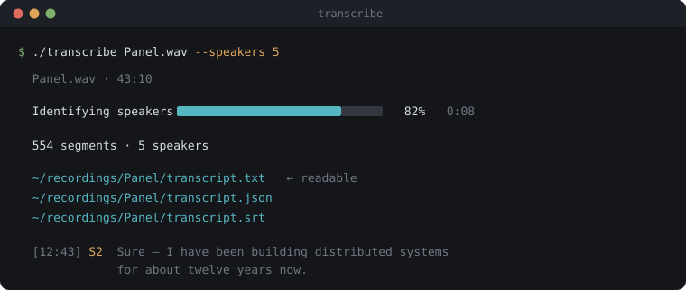

# mac-transcriber

Local-first media transcription for macOS. Point it at a video or audio file
on disk and get back a structured, punctuated transcript with anonymous
speaker labels (`S1`, `S2`, …) — powered entirely by Apple's on-device
[SpeechAnalyzer](https://developer.apple.com/documentation/speech/speechanalyzer)
for transcription and [FluidAudio](https://github.com/FluidInference/FluidAudio)
for speaker diarization. Nothing leaves the machine except a one-time model
download.

The transcript schema is designed as the input to a future "turn this into
a blog article/guide" step (not built here) — a flat, clean `text` field for
prose quality, plus timestamped `segments` for citing the source media.

<p align="center">
  
</p>

> **Status:** a personal project, shared in case it's useful. It works and it's
> tested, but it's built for one person's workflow on one Mac. No support,
> roadmap, or backwards-compatibility promises. Issues and forks welcome.

## Quick start

```sh
git clone https://github.com/yrocaz/mac-transcriber.git
cd mac-transcriber
./transcribe /path/to/recording.wav      # one file
./transcribe /path/to/recordings/        # or a whole tree
```

The wrapper builds both components on first run, then asks how many speakers
are in the recording (answer it — see below), shows a live progress bar, and
writes the transcript to a folder beside your media file:

```
recordings/
├── Panel.wav
└── Panel/
    ├── transcript.txt    ← readable, speaker-labelled prose
    ├── transcript.json   ← timestamped segments + metadata
    ├── transcript.srt    ← subtitles
    └── review.md         ← the spots worth double-checking
```

Roughly **60× realtime** on Apple silicon: a 43-minute recording finishes in
about 45 seconds.

### Your recordings stay yours

Everything runs on your machine — the only network traffic is a one-time model
download on first use. Nothing is uploaded, ever.

The shipped `.gitignore` also assumes you might drop a recording into a clone
to try it out, so transcripts, job records, media files, and the usual
`recordings/` and `transcripts/` folders are all ignored by default. You would
have to `git add -f` to commit your own material by accident.

### Tell it how many speakers there are

This is the single highest-impact thing you can do for transcript quality.
Automatic clustering under-clusters real multi-party audio: a measured
5-person panel came back as **3 speakers**, with one merged cluster absorbing
27 of its 41 talking minutes. Supplying the count fixes it.

```sh
./transcribe Panel.wav --speakers 5              # exact count, when known
./transcribe Panel.wav --min-speakers 3 --max-speakers 6   # a range
./transcribe Panel.wav --no-diarize              # skip speakers entirely, faster
```

Run `./transcribe --help` for the rest. Interactive runs prompt for the count;
piped or scripted runs never block, and `--no-prompt` disables the question.

The HTTP API takes the same hints as `speakers` / `minSpeakers` /
`maxSpeakers` on `POST /jobs`.

### Transcribe a whole folder

Point it at a directory and it walks the tree:

```sh
./transcribe ~/Recordings --out ~/Transcripts --hints hints.txt
```

```
  [7/43] 3rd State of Econ/3rd state of econ - panel.wav
  Transcribing  ████████████████░░░░░░░  68%  ~24s

  43 media files · 42 transcribed · 0 skipped · 1 failed
  1 recovered from damaged source media

  failed:
    Sept 2023 - Tenant - Landlord Edit 2.mp3 — audioReadFailed: no audio track

  log: /Users/you/Transcripts/_run.log
```

With `--out`, the source layout is mirrored under it, so identically-named
files stay separate — this matters more than it looks. A real archive had
`Panel.wav` in four different event folders; writing them all to one directory
would leave 4 recordings and 1 surviving transcript.

```
Recordings/Next Deal Edit/Panel.wav  →  Transcripts/Next Deal Edit/Panel/
```

Without `--out`, each file's transcripts land beside it, exactly as in
single-file mode.

Check a hints file before committing hours — `--dry-run` walks the tree,
resolves every rule, and stops:

```sh
./transcribe ~/Recordings --out ~/Transcripts --hints hints.txt --dry-run
```

```
    →  3rd State of Econ/3rd state of econ - panel.wav   5 speakers via "*[Pp]anel*"
    →  24 Year In Review - Edit/Zac.wav                  1–2 speakers via "*Intro*"
   skip Finding Money Edit/happy birthday.wav            1–2 speakers via "*Intro*"

  would transcribe 42, skip 1 (already done)
```

A rule that never appears in that middle column never matched. The real run
executes the same plan the preview printed, so the two cannot disagree.

Three behaviours make an unattended run survivable:

- **Completed files are skipped**, so an interrupted run resumes for free.
  `--force` reprocesses everything.
- **One bad file costs one file.** The run continues and exits non-zero, with
  every failure named in the summary and in `_run.log`.
- **`_run.log`** is written as the run goes, so you can tail it from another
  terminal.

#### Per-file speaker hints

One `--speakers` for a whole archive is wrong whenever panels and solo
segments share a tree. A hints file routes each file to the right count — one
glob per line, **first match wins**, `#` comments:

```
# hints.txt
*[Pp]anel*        --speakers 5
*Market Update*   --min-speakers 1 --max-speakers 2
*Intro*           --min-speakers 1 --max-speakers 2
*/RR.wav          --min-speakers 1 --max-speakers 2
*                 --speakers 5
```

Globs match the path relative to the walk root — so `*/RR.wav` is
folder-aware — and support `*`, `?`, and `[...]` classes. Names with spaces
work as written: the glob ends at the first flag, not the first space. Files
matching no rule fall back to the `--speakers`/`--min-speakers`/`--max-speakers`
you passed on the command line.

Only speaker flags are allowed in a rules file, and an unknown flag is a hard
error naming the line — a typo'd `--speaker 5` that silently parsed as "no
hint" would mis-diarize every file the rule was written for.

See [docs/batch-transcription.md](docs/batch-transcription.md) for a full
worked example.

### Damaged source media recovers itself

Some files are subtly corrupt. The signature is a transcription that aborts
partway through at the *same* offset every time — a damaged frame, not bad
luck, so retrying the same input fails identically forever.

When a job fails either before the audio opens (`audioReadFailed`) or partway
through with a generic error, the transcript is re-attempted **once** from an
`afconvert` WAV re-encode of the same audio. That rewrites the stream and
usually clears the fault:

```
warning: recoveredByReencode: Source media failed at 62.3% (unknown);
         transcribed from an afconvert WAV re-encode.
```

Recovered transcripts record the **original** file as their source, not the
temp copy, and the warning is kept so a recovered transcript is
self-describing. Your media is never modified. A failure at 0% is *not*
retried — nothing was decoded, so the fault is upstream of the audio and a
re-encode would only waste minutes.

### Know where the transcript is shaky

Every run writes a `review.md` listing the places the engine was least sure of,
worst first — typically a few dozen spots per hour, each with a timestamp, the
sentence it sits in, and the engine's own runner-up guesses:

```markdown
### 28:36 · S2 — `then` (0.159)

> Like, a contract is only as good as it is enforceable, and if it costs you
> more to sue someone, **then** you hope to get back.

Also considered: `someone than`, `someone, than`
```

That one is a real error, and the correct word is sitting in the alternatives.

It exists because the obvious quality check does not work: SpeechAnalyzer is
**deterministic**, so transcribing a file repeatedly and diffing the runs finds
nothing. Measured over five runs across two files, output is byte-identical —
including a byte-identical reproduction of a known diarization defect. A
decoder that is confidently wrong is wrong the same way every time, so
self-consensus cannot see it. Per-word confidence can.

Two caveats worth keeping in mind:

- A clean `review.md` is a statement about the model's certainty, not a
  guarantee of accuracy. Confident errors look exactly like correct output.
- The alternatives are hints, not corrections. Sometimes they contain the right
  answer; often they do not.

Tuning lives in [`server/src/review.ts`](server/src/review.ts) — the confidence
threshold, the filler-word filter, and how many entries to show. Full
measurements: [docs/2026-08-07-repeat-run-determinism.md](docs/2026-08-07-repeat-run-determinism.md).

## What it is

Two components in one repo:

- **`helper/`** — a Swift command-line tool (`speech-helper`) that opens a
  media file, transcribes its audio via SpeechAnalyzer, diarizes speakers
  via FluidAudio, and streams NDJSON progress/result events on stdout.
- **`server/`** — a TypeScript/Fastify HTTP API (Node 22+) that accepts
  transcription jobs, spawns `speech-helper` per job, supervises it (three
  independent timeouts, stderr capture, restart recovery), assembles the
  final transcript (merging diarization onto sentence segments by maximum
  time overlap), and serves it back as JSON or SRT.

No database — job records live as JSON files under `data/jobs/<id>/`. No
authentication — the API binds to `127.0.0.1` only and is meant to run
alongside you on your own Mac, not be exposed to a network.

Task guides:

- [Transcribing an archive](docs/batch-transcription.md) — tree mode end to
  end, hints files, resuming, verifying a finished batch
- [Troubleshooting](docs/troubleshooting.md) — symptom-first: damaged media,
  missing transcripts, under-clustered panels, hints that don't match

Full design rationale, API contract, and the research this was built from:

- [Design spec](docs/superpowers/specs/2026-07-27-media-transcriber-design.md)
- [Tree mode & recovery spec](docs/superpowers/specs/2026-08-07-tree-mode-and-recovery-design.md)
- [Apple SpeechAnalyzer research](docs/research/2026-07-27-apple-speechanalyzer-docs.md)
- [FluidAudio evaluation notes](docs/research/2026-07-27-fluidaudio-notes.md)
- [GitHub OSS ecosystem research](docs/research/2026-07-27-github-oss-research.md)
- [Verification spikes](docs/research/spikes/README.md)

## Requirements

- **macOS 26+** — SpeechAnalyzer is a macOS 26 system framework; there is no
  Linux/Docker path, by design (verified against macOS 26.5.2 on this
  machine).
- **Xcode or Xcode Command Line Tools with a Swift 6.2+ toolchain**, on the
  macOS 26 SDK. Verified on this machine with Command Line Tools alone
  (`xcode-select -p` → `/Library/Developer/CommandLineTools`), `swift-driver
  version: 1.148.6`, `Apple Swift version 6.3.3`. See
  [Development notes](#development-notes) below for a caveat if your Mac
  also has a full Xcode.app installed.
- **Node.js 22+** (verified with Node 25.9.0 / npm 11.12.1 here — anything
  ≥22 per `server/package.json`'s `engines` field should work).
- Network access **once**, the first time diarization runs on a fresh
  machine (FluidAudio's CoreML models download from HuggingFace; fully
  offline afterward). SpeechAnalyzer's own language models are managed by
  the OS and download automatically as needed the first time a locale is
  used.

## Build

```bash
# 1. Swift helper (release build; ~68s clean, seconds when cached)
cd helper
swift build -c release
# Build complete! (67.73s)

# 2. TypeScript server
cd ../server
npm install
npm run build   # tsc -p tsconfig.json
```

The helper binary lands at `helper/.build/release/speech-helper`; the
server's compiled output at `server/dist/`. The server locates the helper
binary at that default path automatically (override with
`TRANSCRIBER_HELPER_PATH` — see [Configuration](#configuration)).

Verify the helper on its own before wiring up the server:

```bash
$ helper/.build/release/speech-helper status
{"available":true,"installedLocales":["en-AU","en-CA","en-GB","en-IE","en-IN","en-NZ","en-SG","en-US","en-ZA"],"supportedLocales":["de-AT","de-CH","de-DE","en-AU","en-CA","en-GB","en-IE","en-IN","en-NZ","en-SG","en-US","en-ZA","es-CL","es-ES","es-MX","es-US","fr-BE","fr-CA","fr-CH","fr-FR","it-CH","it-IT","ja-JP","ko-KR","pt-BR","pt-PT","yue-CN","zh-CN","zh-HK","zh-TW"]}
```

## Run

```bash
cd server
npm run build && npm start   # node dist/index.js
# or, for development (no build step, TS run directly via tsx):
npm run dev
```

```
$ npm start
media-transcriber server listening on http://127.0.0.1:4173
```

The server binds `127.0.0.1` only — never `0.0.0.0` — and that binding is
hardcoded, not configurable, since the API has no authentication of its
own. Confirmed on this machine:

```
$ lsof -nP -iTCP:4173 -sTCP:LISTEN
COMMAND   PID   USER   FD   TYPE             DEVICE SIZE/OFF NODE NAME
node    84589 studio   12u  IPv4 0xe32a4db2d71c03b5      0t0  TCP 127.0.0.1:4173 (LISTEN)
```

### Configuration

All optional, read from the environment at startup (`server/src/config.ts`):

| Variable | Default | Meaning |
|---|---|---|
| `PORT` | `4173` | HTTP port (loopback only) |
| `TRANSCRIBER_DATA_DIR` | `<repo>/data` | Where `jobs/<id>/{job.json,transcript.json,transcript.srt}` are written |
| `TRANSCRIBER_HELPER_PATH` | `<repo>/helper/.build/release/speech-helper` | Path to the helper binary |

## API

Base URL: `http://127.0.0.1:4173` (use `127.0.0.1` literally — the server
does not bind `::1`/`localhost`'s IPv6 resolution).

### `POST /jobs` — submit a job

Body: `{ "path": "<local file path>", "locale"?: "en-US", "diarize"?: true }`.
`diarize` defaults to `true`; both `transcript.json` and `transcript.srt`
are always produced.

```
$ curl -sS -i -X POST http://127.0.0.1:4173/jobs \
    -H 'Content-Type: application/json' \
    -d '{"path":"/Users/you/media-transcriber/test-fixtures/speech-short.aiff"}'
HTTP/1.1 202 Accepted
content-type: application/json; charset=utf-8

{"id":"5nsnpxn90pj3","status":"queued"}
```

Validation errors return `400` before any job is created:

```
$ curl -sS -i -X POST http://127.0.0.1:4173/jobs -H 'Content-Type: application/json' \
    -d '{"path":"/nonexistent/file.mp3"}'
HTTP/1.1 400 Bad Request
{"error":"File does not exist: /nonexistent/file.mp3"}

$ curl -sS -i -X POST http://127.0.0.1:4173/jobs -H 'Content-Type: application/json' \
    -d '{"path":"/etc/hosts"}'
HTTP/1.1 400 Bad Request
{"error":"Unsupported file extension \"(none)\". Supported: mp4, mov, m4v, mp3, m4a, wav, aiff, aif, caf"}
```

### `GET /jobs/:id` — poll status

```
$ curl -sS http://127.0.0.1:4173/jobs/5nsnpxn90pj3
{"id":"5nsnpxn90pj3","path":"/Users/you/media-transcriber/test-fixtures/speech-short.aiff","locale":"en-US","diarize":true,"status":"done","progress":1,"warnings":[],"error":null,"timings":{"createdAt":"2026-08-04T12:44:25.373Z","startedAt":"2026-08-04T12:44:25.373Z","finishedAt":"2026-08-04T12:44:26.304Z"},"durationSec":6.571}
```

`status` is one of `queued` / `running` / `done` / `error`. There is no
push/SSE channel — poll this endpoint (by design, YAGNI for a
single-machine tool).

### `GET /jobs` — list jobs, newest first

```
$ curl -sS http://127.0.0.1:4173/jobs
[{"id":"5nsnpxn90pj3","path":"...","status":"done", ...}]
```

### `GET /jobs/:id/transcript.json` — structured transcript

```
$ curl -sS http://127.0.0.1:4173/jobs/5nsnpxn90pj3/transcript.json
{"metadata":{"source":"/Users/you/media-transcriber/test-fixtures/speech-short.aiff","durationSec":6.571,"locale":"en-US","engine":"apple-speechanalyzer","diarization":"ok","speakerCount":1,"createdAt":"2026-08-04T12:44:25.373Z"},"text":"The quick brown fox jumps over the lazy dog. Apple's speech analyzer runs entirely on device.","segments":[{"id":0,"start":0,"end":2.88,"text":"The quick brown fox jumps over the lazy dog.","speaker":"S1"},{"id":1,"start":2.94,"end":6.571,"text":"Apple's speech analyzer runs entirely on device.","speaker":"S1"}]}
```

A two-speaker interview (`test-fixtures/two-voice-interview.wav`) produces
`speakerCount: 2` and alternating `S1`/`S2` labels by maximum time overlap
between each sentence and the diarizer's speaker turns:

```json
{
  "metadata": { "diarization": "ok", "speakerCount": 2, "durationSec": 41.698, "...": "..." },
  "segments": [
    { "id": 0, "start": 0,    "end": 1.5,  "text": "Thanks for joining me today.", "speaker": "S1" },
    { "id": 2, "start": 5.82, "end": 6.96, "text": "Sure.", "speaker": "S2" }
  ]
}
```

404 if the job doesn't exist or hasn't reached `done` yet.

### `GET /jobs/:id/transcript.srt` — subtitles

```
$ curl -sS http://127.0.0.1:4173/jobs/5nsnpxn90pj3/transcript.srt
1
00:00:00,000 --> 00:00:02,880
The quick brown fox jumps over the lazy dog.

2
00:00:02,940 --> 00:00:06,571
Apple's speech analyzer runs entirely on device.
```

`Content-Type: text/plain; charset=utf-8`. Same 404 rules as above.

### `GET /health`

```
$ curl -sS http://127.0.0.1:4173/health
{"status":"ok","helper":{"available":true,"supportedLocales":["de-AT","de-CH","de-DE","en-AU","en-CA","en-GB","en-IE","en-IN","en-NZ","en-SG","en-US","en-ZA","es-CL","es-ES","es-MX","es-US","fr-BE","fr-CA","fr-CH","fr-FR","it-CH","it-IT","ja-JP","ko-KR","pt-BR","pt-PT","yue-CN","zh-CN","zh-HK","zh-TW"],"installedLocales":["en-AU","en-CA","en-GB","en-IE","en-IN","en-NZ","en-SG","en-US","en-ZA"]}}
```

Always returns `200`; `status` is `"degraded"` (with `helper: null`) if the
binary is missing, not executable, or its `status` subcommand fails —
never a `503`.

## Output format

`transcript.json` (spec-designed for a future article-generation step):

```jsonc
{
  "metadata": {
    "source": "/path/to/input",
    "durationSec": 41.698,
    "locale": "en-US",
    "engine": "apple-speechanalyzer",
    "diarization": "ok",        // "ok" | "failed" | "disabled"
    "speakerCount": 2,          // null unless diarization == "ok"
    "createdAt": "2026-08-04T12:44:25.373Z"
  },
  "text": "Full transcript as clean, punctuated prose...",
  "segments": [
    {
      "id": 0,
      "start": 0.0,
      "end": 1.5,
      "text": "Sentence-level segment.",
      "speaker": "S1",
      "confidence": 0.973   // mean per-word confidence; null if unmeasured
    }
  ]
}
```

`speaker` is an anonymous id (`S1`, `S2`, …, ordered by first appearance)
when diarization succeeds, `null` when it's disabled or failed —
`metadata.diarization` says which. `diarization: "failed"` (e.g. music with
no detectable speech) is not an error: the job still completes, the
transcript is delivered (possibly empty), and the reason lands in the job's
`warnings[]`.

`confidence` is the **mean** of the sentence's per-word scores, not the
minimum — on real audio the minimum is held by function words and disfluencies
(measured floor tokens on a 43-minute recording: `their` at 0.001, `the` at
0.031), so a min-based score would render almost every sentence as near-zero.
An article-generation step can use it to weigh how much to assert from a given
sentence; the per-word detail behind a low score lives in `review.md`.

Supported input extensions: `mp4 mov m4v mp3 m4a wav aiff aif caf`. Video
containers work directly through `AVAudioFile` on macOS 26 — no ffmpeg.
`mkv`/`webm`/`ogg` are out of scope (unsupported by AVFoundation).

## Checks

Five gates, all runnable locally and all enforced two ways — a pre-push hook
and GitHub Actions:

```bash
cd server
npm run format:check   # prettier
npm run lint           # eslint (typescript-eslint recommended)
npm run typecheck      # tsc --noEmit
npm test               # vitest unit suite
npm run build          # tsc emit

# Swift side, from the repo root:
swift format lint --strict --recursive helper/Sources helper/Tests
cd helper && swift build -c release && ./scripts/swift-test.sh
```

**The pre-push hook is the gate that matters.** This repo has no branch
protection, so CI reports after the fact and cannot block anything. The hook
runs all of the above in about 11 seconds and refuses the push on failure. It
installs itself via the `prepare` script on `npm install` — including the
install `./transcribe` does on first run — so you get it without doing
anything. Emergency bypass is `git push --no-verify`.

The Swift steps are skipped when no toolchain is on `PATH`, so editing docs on
a machine without Swift isn't blocked. CI checks them regardless.

### Formatting and linting

- **Prettier** with a near-default config: `printWidth: 100`, double quotes.
  Both settings encode what the codebase already did by hand, so adopting it
  reformatted code rather than restyling it. **Markdown is excluded** — see
  `server/.prettierignore` for why.
- **ESLint** with `typescript-eslint` **recommended** (not `strict`), plus
  `eslint-config-prettier` last so formatting belongs to Prettier alone. Three
  rules are tuned to house idioms — non-null assertions, commented empty
  catches, `no-console` — each with its reasoning inline in
  `server/eslint.config.mjs`.
- **swift-format**, which ships with the Swift 6 toolchain (nothing to
  install). `.swift-format` at the repo root sets `lineLength: 100` and
  4-space indentation to match the existing Swift; at its 2-space default it
  reported 787 findings that were purely a config mismatch, not real drift.
  It does not reflow comments, so the explanation-dense files are unaffected.

### CI

[`.github/workflows/ci.yml`](.github/workflows/ci.yml) runs two jobs on
`macos-latest`, split so a Swift toolchain problem can't mask a TypeScript
regression.

Both jobs need macOS, for reasons worth knowing:

- The **server** job, because `recover.test.ts` shells out to the real
  `afconvert`. The rest of the unit suite is portable — the fake helper never
  opens its input — but those tests are not.
- The **helper** job, because `Package.swift` pins `.macOS(.v26)`.
  `macos-latest` points at macOS 26 as of the June 2026 image migration.

Two things the workflow deliberately does *not* do, both documented inline so
nobody "fixes" them:

- **It never runs `swift test` directly.** On a Command Line Tools-only
  toolchain SwiftPM builds the suite and then silently declines to run it —
  exit 0, zero output, even with a deliberately failing test present. A step
  calling `swift test` would be a permanent false green. `scripts/swift-test.sh`
  passes the swift-testing search paths on the command line, which is what
  makes the runner execute.
- **It never runs the E2E suite**, which needs the real helper, a first-use
  model download over the network, and the generated fixtures below.

## Testing

Two separate suites, matching the spec's split between fast fake-helper
unit tests and a real, slower end-to-end suite:

```bash
cd server
npm test          # unit suite: fake helper, no real Swift binary, no network
npm run test:e2e  # E2E suite: real speech-helper, real media, macOS only
```

**Before running `npm run test:e2e` on a fresh clone, generate the required
fixtures first:**

```bash
./scripts/make-fixtures.sh
```

This is a required prerequisite, not an optional extra — `test-fixtures/malformed.mp3`
(and its `.json` sidecar) are gitignored and only exist after running this
script. Without them, the MP3-repair E2E case (`malformed MP3 fixture: the
tail-probe/repair path produces a correct transcript`) silently skips rather
than failing loudly, and it is the *only* coverage of `AudioPreparer.swift`'s
tail-probe/repair branch — the same branch whose ~90s
`AVAssetExportSession` cost drove the startup timeout from 60s to 180s (see
[Development notes](#development-notes)). Skipping it means that regression
has no test coverage at all. See [Fixtures](#fixtures) below for what else
the script generates and why the malformed MP3 isn't committed.

```
$ npm test
 ✓ test/unit/progress.test.ts (7 tests)
 ✓ test/unit/config.test.ts (3 tests)
 ✓ test/unit/transcript.test.ts (25 tests)
 ✓ test/unit/hints.test.ts (17 tests)
 ✓ test/unit/review.test.ts (19 tests)
 ✓ test/unit/tree.test.ts (10 tests)
 ✓ test/unit/cliRender.test.ts (19 tests)
 ✓ test/unit/cliArgs.test.ts (9 tests)
 ✓ test/unit/jobStore.test.ts (10 tests)
 ✓ test/unit/recover.test.ts (9 tests)
 ✓ test/unit/runFile.test.ts (7 tests)
 ✓ test/unit/cliMain.test.ts (11 tests)
 ✓ test/unit/routes.test.ts (23 tests)
 ✓ test/unit/runTree.test.ts (10 tests)
 ✓ test/unit/supervisor.test.ts (14 tests)
 Test Files  15 passed (15)
      Tests  193 passed (193)
```

`npm run test:e2e` builds `speech-helper` automatically if the release
binary is missing, and skips cleanly (with a console warning, exit 0) on
non-macOS or if the Swift toolchain/build isn't available. It runs a
warm-up job first so a first-run FluidAudio model download (from
HuggingFace, one-time, network required) lands there rather than inside a
timed test:

```
$ npm run test:e2e
[e2e] Warm-up run (first-run model download can take a while; subsequent runs are fast)...
[e2e] Warm-up job ... finished with status done.
 ✓ test/e2e/e2e.test.ts (6 tests) 96925ms
   ✓ single-voice fixture: POST -> poll -> transcript text matches known content
   ✓ two-voice fixture: speakerCount is 2 and segments carry S1/S2
   ✓ sample-5s.mp4 (music, no speech): completes done with an empty transcript and a diarization warning
   ✓ transcript.srt route returns well-formed SRT
   ✓ malformed MP3 fixture: the tail-probe/repair path produces a correct transcript
 Test Files  1 passed (1)
      Tests  6 passed (6)
```

### Fixtures

`test-fixtures/` (repo root):

| File | Source | Committed? |
|---|---|---|
| `speech-short.aiff` | `say`-generated, single voice | yes |
| `two-voice-interview.wav` | `say`-generated, two alternating voices (Samantha/Daniel) | yes |
| `sample-5s.mp4` | downloaded from [samplelib.com](https://samplelib.com/sample-mp4.html) (music, no speech — verifies container handling) | yes |
| `malformed.mp3` | generated locally from a macOS system resource (see below) | **no** |
| `malformed.mp3.json` | sidecar: the fixture's true/declared duration (see below) | **no** |

`scripts/make-fixtures.sh` regenerates the `say`-based fixtures and the
malformed MP3:

```bash
./scripts/make-fixtures.sh
```

It does **not** touch `sample-5s.mp4` (external, re-download manually if
ever lost) and, per the note in the script, a full re-run of the `say`
fixtures produces functionally-equivalent but not byte-identical audio
(SpeechAnalyzer's exact segmentation/punctuation can shift very slightly
across macOS/model versions) — verified while writing it, documented
inline, and the E2E suite's assertions are written to tolerate it.

**The malformed-MP3 fixture** exercises a real, previously-unverified code
path: `AudioPreparer.swift`'s tail-probe/repair branch (an MP3 that
misreports its packet count triggers a re-export to a temp M4A via
`AVAssetExportSession`). This was a carried gap from Task 1 — no MP3
encoder was available to construct one. It's now built by taking a real,
well-formed MP3 macOS ships as a system voice-enrollment prompt
(`PersonalAudio.framework`) and prepending one synthetic MPEG frame with a
lying `Xing`/VBR header (correct frame syntax, inflated frame-count field).
It's **not committed to git** — the output is ~99.9% byte-identical to
Apple's shipped audio resource, which isn't ours to redistribute — so it
only exists after running `scripts/make-fixtures.sh`, and the E2E case that
needs it skips with a clear message (naming the script) if it's absent.

The script also writes `malformed.mp3.json`, a small sidecar recording the
fixture's true (real, decodable) and declared (Xing-header lie) durations
in seconds — e.g. `{"trueDurationSec": 32.731, "declaredDurationSec":
130.926, ...}`. The E2E test reads this rather than asserting against a
hardcoded number, so the assertion states the actual invariant ("repair
recovers a duration near the true value, far below the declared one") and
keeps working if the script's frame-count math or the source system MP3
changes on a future macOS. Both files are written atomically (temp path +
`mv`) and regenerated together — the E2E case treats either one missing
as "fixture not ready" and skips.

## Development notes

- **Command Line Tools only, no Xcode.app, on this machine.** `xcode-select -p`
  → `/Library/Developer/CommandLineTools`; `xcodebuild -version` fails with
  "requires Xcode, but active developer directory ... is a command line
  tools instance". `swift build -c release` works fine on this toolchain. If
  you switch toolchains (e.g. install a full Xcode.app), re-verify it still
  picks up the macOS 26 SDK (`.macOS(.v26)` in `helper/Package.swift`
  requires it).
- **Run Swift tests via `helper/scripts/swift-test.sh`, not bare `swift test`.**
  On this Command Line Tools-only toolchain, `swift-testing` (`import Testing`,
  used by `helper/Tests/speech-helperTests/`) needs help in two independent
  ways, both fixed, one at the manifest level and one at the invocation
  level:
  - *Compiling and linking* (`helper/Package.swift`): `Testing.framework`
    isn't on the default search/runtime-load path outside a full Xcode.app
    install. `swift build`/bare `swift test` used to fail to even compile
    the test target (`no such module 'Testing'`). `Package.swift` now
    probes `DEVELOPER_DIR`/the fixed Command Line Tools path at manifest
    evaluation time and, if `Testing.framework` is found there, bakes a
    framework search path and rpath into the test target's build settings
    (`swiftSettings`/`linkerSettings`) — this makes the target compile,
    link, and (if invoked directly) run correctly.
  - *Actually running the suite*: even with the manifest fix, **bare
    `swift test` on this toolchain silently does nothing** — confirmed by
    temporarily adding a deliberately-failing test and running bare
    `swift test`: exit 0, zero output, even with a guaranteed failure
    present. That's not a display quirk (a quirk can't turn a failing test
    into a clean exit) — SwiftPM's own decision to invoke the test runner
    apparently keys off top-level `-Xswiftc`/`-Xlinker` CLI flags, not a
    target's own build settings, so without those flags on `swift test`'s
    own command line it skips running the suite entirely, silently. Passing
    the same search-path flags directly on `swift test`'s CLI (rather than
    only via the manifest) makes it run correctly, with proper pass/fail
    reporting and exit codes. `helper/scripts/swift-test.sh` does exactly
    that (same directory-probing logic as the manifest); run it instead of
    bare `swift test`:
    ```
    $ helper/scripts/swift-test.sh
    ...
    ✔ Test run with 8 tests in 2 suites passed after 0.004 seconds.
    ```
  This is a SwiftPM/toolchain limitation on a Command Line Tools-only
  install, not a code defect, and the wrapper degrades to a thin `swift
  test` passthrough on a toolchain where the framework is already found
  normally (e.g. a full Xcode.app install) — see the wrapper script's header
  comment for the full writeup.
- **Model downloads.** The first diarized job on a fresh machine downloads
  FluidAudio's CoreML models from HuggingFace (network required once, then
  fully offline; `ModelHub.offlineMode`/`REGISTRY_URL` exist for control).
  SpeechAnalyzer's own locale models are OS-managed and download
  automatically the first time a locale is used. Budget for this in any
  timeout you set around a first run — the E2E suite's warm-up step exists
  specifically for this.
- **`AVAssetExportSession` has a fixed ~90-second overhead in this
  environment, unrelated to file size or format — the startup timeout was
  raised from 60s to 180s (spec §6, `server/src/config.ts`) to
  accommodate it.** While building the malformed-MP3 E2E case,
  `AudioPreparer.repair()`'s `AVAssetExportSession(presetName: .appleM4A)`
  call was measured taking **~90 seconds** to re-export a 32.7-second MP3 —
  reproducibly, and for a *well-formed* MP3 too (isolated with a standalone
  Swift script calling only `AVAssetExportSession`, outside the helper
  entirely; not an artifact of the fabricated test fixture). To narrow down
  whether this was an MP3-decode cost or something broader, the same
  isolated script was run against a completely different input — the
  6.6-second `speech-short.aiff` fixture (AIFF, not MP3) — and it *also*
  took ~90 seconds. A 6.6s AIFF and a 32.7s MP3 costing the same ~90s to
  export rules out "proportional to audio length" or "MP3-decode-specific"
  and points at a fixed, per-call overhead in `AVAssetExportSession` itself
  on this machine — plausibly a hardware media-encode session negotiation
  timeout falling back to software in a sandboxed/virtualized environment,
  though this is a hypothesis, not confirmed. This exceeded the original
  60-second startup timeout, which meant the MP3-repair path the timeout
  is meant to accommodate would always be killed before finishing — dead on
  arrival for the exact case it exists to handle. Fixed by raising
  `DEFAULT_TIMEOUTS.startupTimeoutMs` to 180s (comfortable margin over the
  ~90s measurement, while still catching a genuinely hung/missing helper);
  see `server/src/config.ts` for the rationale comment and
  `server/test/unit/config.test.ts` for a pinning test. The measurement
  itself is environment-dependent and worth re-confirming on non-sandboxed
  hardware — if `speech-short.aiff` exports in ~2s there, this was
  specific to this sandboxed environment — but the larger timeout budget
  is harmless regardless of where the ~90s came from.

## Known limitations

- **Diarization decodes the whole prepared audio file into memory at once.**
  `DiarizationAudioDecoder.swift` reads the entire input into a single
  `AVAudioPCMBuffer` and converts it in one pass, rather than streaming/
  chunking. Memory use scales with media length (and, more precisely, with
  the *decoded* PCM size, so format/duration both matter — e.g. roughly
  ~645MB for 30 minutes of 16 kHz mono Float32, ~2.5GB for 2 hours) — fine
  for this v1's personal-pipeline scale, but something to budget for on very
  long recordings. Switching to FluidAudio's own URL-based `process()`
  entry point would avoid this, but it doesn't allow setting
  `primeMethod = .none` on its internal `AVAudioConverter`, which spec §4
  item 7 mandates (the BufferConverter pattern's rationale: avoiding
  timestamp drift from source). Chunked decode that keeps `primeMethod =
  .none` is a real option but a larger change than a fix-review pass
  should make — left as a v2 item. In the meantime, diarization failure
  (including an out-of-memory condition) degrades gracefully by design: any
  error there is non-fatal (spec §8), reported as a `diarizationFailed`
  warning, and the transcript from transcription is still delivered intact.
- **Damaged-media recovery needs temp space proportional to the recording.**
  `recover.ts` re-encodes to uncompressed 16-bit mono WAV, so a 56-minute MP3
  becomes roughly 300MB in `$TMPDIR` for the duration of the retry. The file
  is removed in a `finally` (including when transcription throws), so a batch
  cannot accumulate them — but a single very long recording still needs the
  headroom while it runs. Recovery is attempted once per file, never in a
  loop.
- **Per-event synchronous whole-record disk write.** `JobStore.persist()`
  (in `jobStore.ts`) rewrites the entire `job.json` on every single job
  update, synchronously. Fine at this project's scale (single-user,
  concurrency-1 queue, small JSON records); not something this pass changed.

## Out of scope (v1)

Article/guide generation, named speakers (voice enrollment), file upload,
auth, SSE/WebSocket progress, and `mkv`/`webm`/`ogg` via ffmpeg. See the
[design spec](docs/superpowers/specs/2026-07-27-media-transcriber-design.md#out-of-scope-v1)
for the full list and rationale.

## Contributing

This is a personal project, so there's no roadmap to align with — but bug
reports and pull requests are welcome. If you're changing behaviour, please
run `cd server && npm test` (unit, fast, offline) and, when your change
touches the helper or the job pipeline, `npm run test:e2e` after generating
fixtures with `scripts/make-fixtures.sh`. Note the `swift test` caveat in
[Development notes](#development-notes) — use `helper/scripts/swift-test.sh`,
not bare `swift test`, or you'll get a green suite that ran nothing.

## Credits

Built by studying existing work rather than designing from scratch. The Swift
helper owes most of its shape to [yap](https://github.com/finnvoor/yap);
speaker diarization is [FluidAudio](https://github.com/FluidInference/FluidAudio);
the hybrid architecture follows the precedent set by
[swift-scribe](https://github.com/FluidInference/swift-scribe).

Full attribution — dependencies, borrowed patterns, model licensing, and the
primary sources the design was written against — is in [CREDITS.md](CREDITS.md).

## License

[MIT](LICENSE) — free to use, copy, modify, and distribute.
